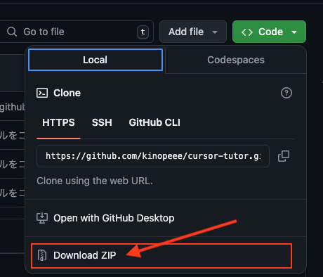

# 書籍「AIエディタCursor完全ガイド」 第二章サポート用リポジトリ

書籍「AIエディタCursor完全ガイド」の第二章「Cursor の基本操作」で使用するハンズオン用コードを公開するリポジトリです。
- 2024年6月以前に Cursor をインストールされた方は、書籍の手順通りで操作を進めていただくことが可能なはずです（いつ時点でハンズオン例題のコードが同梱されなくなったかが不明ですので、ローカルの「.cursor-tutor」フォルダの有無をご確認ください）。
- 「.cursor-tutor」フォルダがインストールされていない場合は、当リポジトリをローカルにクローン、もしくは「Download ZIP」ボタンから zip 形式でダウンロード後、解凍して、ご利用ください。

- Cursor 同梱の「.cursor-tutor」フォルダは先頭にドットのある隠しフォルダ属性となっていますが、そのままでは Github での表示やダウンロード後の扱いに問題があるため、ドットを除いた「cursor-tutor」というフォルダ名にしてあります。
- 本書内では、英語の手順説明部を訳しながら操作を進めていますが、こちらのサンプルでは最初から日本語にしてあります。

## 📕 このリポジトリの構成

| ディレクトリ | 内容 |
| ---- | ---- |
| getting_started.md | 書籍内の .cursor-tutor/getting_started.md ファイル |
| python | 2.1 基本操作ハンズオン Python 編 |
| javascript | 2.2 基本操作ハンズオン JavaScript 編<br>（※zipファイルを解凍後ご利用ください） |
| samples | 生成されたサンプルコード |

【注意点】
1. フォルダ名が「.cursor-tutor」から「cursor-tutor」に変更されています。
2. 「javascript.zip」ファイルを解凍して「javascript」フォルダにしてください。
3. Cursor 同梱のフォルダ構成にはあった「projects」を省いたフォルダ構成になっています。

上記の変更点を反映したファイル指定やフォルダ移動のコマンドは下記のようになります。

【読み替え後のパス】

P.18
```
Windows
`cursor-tutor\python\main.py`
macOS
`cursor-tutor/python/main.py`
```
P.32
```
Windows
`cursor-tutor\javascript\src\index.js`
macOS
`cursor-tutor/javascript/src/index.js`
```
P.37
```
Windows環境
`cd javascript\`
macOS環境
`cd javascript/`
```

## 📕 ハンズオン例題についての注意

ハンズオン例題 javascript フォルダ内は Create React App (CRA) による React プロジェクトですが、現在は React では Next.js、Remix といったフレームワークの使用が推奨されています。

- [新しい React アプリを作る](https://ja.legacy.reactjs.org/docs/create-a-new-react-app.html) 

本書では、最小限の手間でハンズオンを行なっていただく趣旨から、Cursor に同梱されていたプロジェクトを前提としていますが、ハンズオン例題としてのご利用にとどめるようにご注意ください。
また、ハンズオンでカスタマイズの方法に慣れたら、Next.js などで新規プロジェクトを作成して、Cursor のフォルダとして開き、同じ手順でカスタマイズに挑戦してみてください。

- [React -Web とネイティブユーザインターフェースのためのライブラリ](https://ja.react.dev/) 

## 📕 誤記、エラー等を見つけた場合

 書籍「AIエディタCursor完全ガイド」サポート用リポジトリに [Issues](https://github.com/kinopeee/cursor-perfect-guide/issues) としてご報告ください。ベストエフォートで対応いたします。
